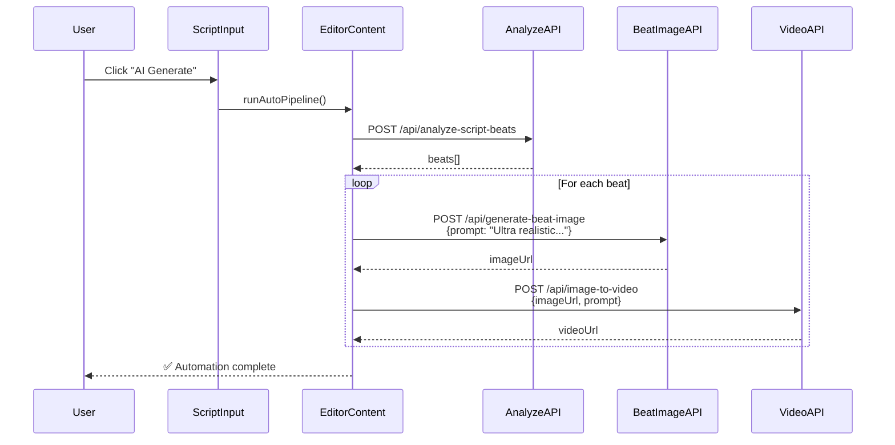
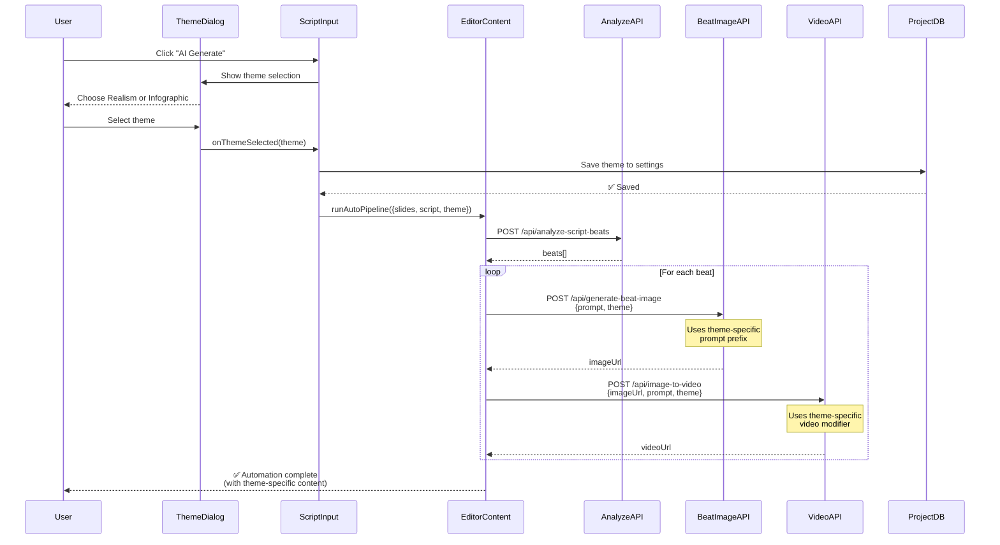

# Automation Flow Comparison

## Current Flow (Without Theme Awareness)



**Issues:**

- ❌ No theme selection
- ❌ Hardcoded "Ultra realistic" prompt
- ❌ Theme not saved to project
- ❌ Can't generate infographic-style content

---

## Proposed Flow (With Theme Awareness)



**Benefits:**

- ✅ User chooses theme before generation
- ✅ Theme-specific prompts for images
- ✅ Theme-specific prompts for videos
- ✅ Theme persisted to project settings
- ✅ Supports both Realism and Infographic styles

---

## Data Flow

### Before (Current)

```typescript
// User clicks "AI Generate"
handleAIGenerate()
  ↓
// No theme selection
runAutoPipeline({ slides, originalScript })
  ↓
// Hardcoded prompt
fetch('/api/generate-beat-image', {
  body: JSON.stringify({
    prompt: beat.visualPrompt
  })
})
  ↓
// API uses hardcoded prefix
body: JSON.stringify({
  prompt: `Ultra realistic, professional, cinematic: ${prompt}`
})
```

### After (Proposed)

```typescript
// User clicks "AI Generate"
handleAIGenerate()
  ↓
// Show theme dialog
setShowThemeDialog(true)
  ↓
// User selects theme
handleThemeSelectedAndGenerate(theme)
  ↓
// Save theme to project
updateProject({ settings: { imageTheme: theme } })
  ↓
// Pass theme to automation
runAutoPipeline({ slides, originalScript, theme })
  ↓
// Pass theme to API
fetch('/api/generate-beat-image', {
  body: JSON.stringify({
    prompt: beat.visualPrompt,
    theme // NEW
  })
})
  ↓
// API uses theme-specific prefix
const themeConfig = getThemeConfig(theme);
body: JSON.stringify({
  prompt: `${themeConfig.promptPrefix} ${prompt}`
})
```

---

## Theme-Specific Output Examples

### Realism Theme

**Beat 1: "Opening Hook"**

- **Visual Prompt:** "Professional businessman in modern office, confident expression"
- **Enhanced Image Prompt:** "Ultra realistic, professional photograph, high quality, 4K resolution, cinematic lighting, clean composition, photorealistic, natural colors, professional photography. Professional businessman in modern office, confident expression"
- **Video Prompt:** "Slow zoom in. Smooth camera movement, realistic motion, natural transitions."
- **Result:** Photorealistic image with cinematic video

**Beat 2: "Problem Statement"**

- **Visual Prompt:** "Frustrated person looking at declining charts on laptop"
- **Enhanced Image Prompt:** "Ultra realistic, professional photograph, high quality, 4K resolution, cinematic lighting, clean composition, photorealistic, natural colors, professional photography. Frustrated person looking at declining charts on laptop"
- **Video Prompt:** "Subtle head shake. Smooth camera movement, realistic motion, natural transitions."
- **Result:** Photorealistic image with natural video motion

---

### Infographic Theme

**Beat 1: "Opening Hook"**

- **Visual Prompt:** "Professional businessman in modern office, confident expression"
- **Enhanced Image Prompt:** "Modern infographic style, clean vector illustration, flat design, minimalist, professional diagram, bold colors, simple shapes, educational visual, icon-based, geometric, contemporary graphic design. Professional businessman in modern office, confident expression"
- **Video Prompt:** "Slow zoom in. Animated infographic elements, smooth transitions, icon movements."
- **Result:** Flat design illustration with animated elements

**Beat 2: "Problem Statement"**

- **Visual Prompt:** "Frustrated person looking at declining charts on laptop"
- **Enhanced Image Prompt:** "Modern infographic style, clean vector illustration, flat design, minimalist, professional diagram, bold colors, simple shapes, educational visual, icon-based, geometric, contemporary graphic design. Frustrated person looking at declining charts on laptop"
- **Video Prompt:** "Subtle head shake. Animated infographic elements, smooth transitions, icon movements."
- **Result:** Vector illustration with animated chart elements

---

## Implementation Checklist

### Phase 1: API Updates

- [ ] Update [`generate-beat-image/route.ts`](src/app/api/generate-beat-image/route.ts)
  - [ ] Accept `theme` parameter
  - [ ] Import `getThemeConfig` from `image-themes`
  - [ ] Use theme-specific prompt prefix
  - [ ] Default to 'realism' if not provided

### Phase 2: Frontend Updates

- [ ] Update [`editor-content.tsx`](src/components/editor/editor-content.tsx)
  - [ ] Add `theme` parameter to `runAutoPipeline`
  - [ ] Pass theme to `/api/generate-beat-image`
  - [ ] Pass theme to `/api/image-to-video`
- [ ] Update [`script-input.tsx`](src/components/editor/script-input.tsx)
  - [ ] Save theme to project settings in `handleThemeSelectedAndGenerate`
  - [ ] Pass theme to `runAutoPipeline` call

### Phase 3: Utilities

- [ ] Update [`image-themes.ts`](src/lib/image-themes.ts)
  - [ ] Add `buildBeatImagePrompt` helper
  - [ ] Add `buildBeatVideoPrompt` helper

### Phase 4: Testing

- [ ] Test Realism theme automation
  - [ ] Verify photorealistic images
  - [ ] Verify smooth camera movements
  - [ ] Verify theme saved to project
- [ ] Test Infographic theme automation
  - [ ] Verify flat design images
  - [ ] Verify animated elements
  - [ ] Verify theme saved to project
- [ ] Test theme persistence
  - [ ] Generate with theme
  - [ ] Reload project
  - [ ] Verify theme remembered

### Phase 5: Documentation

- [ ] Update user documentation
- [ ] Add code comments
- [ ] Create migration guide

---

## Risk Assessment

| Risk                                    | Impact | Mitigation                                                   |
| --------------------------------------- | ------ | ------------------------------------------------------------ |
| Webhook doesn't support new prompts     | High   | Test with both prompt styles; webhook should accept any text |
| Theme not persisting                    | Medium | Add error handling for project updates                       |
| Video generation fails with infographic | Medium | Fallback to image if video fails                             |
| Performance degradation                 | Low    | Same number of API calls as before                           |

---

## Success Metrics

- ✅ Theme selection appears before automation
- ✅ 100% of beats get theme-specific images
- ✅ 100% of beats get theme-specific videos
- ✅ Theme persists across sessions
- ✅ No increase in error rate
- ✅ User can switch themes between generations
