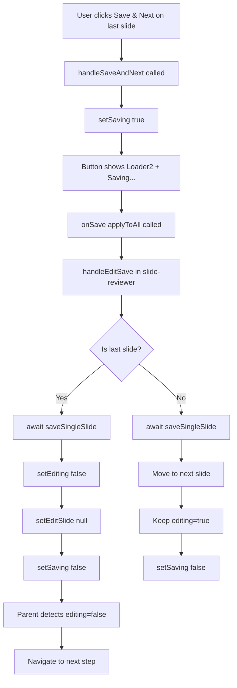

# Fix: Save & Next Button Issues on Last Slide

## Problem Statement

When clicking "Save & Next" on the last slide in the editor:

1. **Long delay** - The button takes a long time before navigating to the next page
2. **No loading feedback** - Users don't know if the save is in progress
3. **Navigation loop** - After saving, the page sometimes returns back to the editor slide instead of proceeding to the next step

## Root Cause Analysis

### Issue 1: Long Delay

Looking at [`handleEditSave`](src/components/editor/slide-reviewer.tsx:367) in `slide-reviewer.tsx`:

```typescript
// Move to next slide and keep editing, or close if done
if (currentIndex < updated.length - 1) {
  const nextIndex = currentIndex + 1;
  setCurrentIndex(nextIndex);
  setEditing(true);
  setEditSlide({ ...updated[nextIndex] });
} else {
  if (savePromise) {
    await savePromise; // ⚠️ Only awaits on last slide
  }
  setViewingSlidesAnyway(false);
  setEditing(false);
  setEditSlide(null);
}
```

**Problem**: The save operation is only awaited on the last slide (line 422-423). This means:

- For regular slides: Save happens in background, navigation is instant
- For the last slide: Navigation waits for the save to complete
- If the save is slow (network latency, large data), the UI appears frozen

### Issue 2: No Loading State

The [`SlideEditPanel`](src/components/editor/slide-edit-panel.tsx:247) component receives an `isSaving` prop but it's not being used:

```typescript
interface SlideEditPanelProps {
  // ... other props
  isSaving?: boolean; // ⚠️ Defined but never used in the component
}
```

The "Save & Next" button (line 794-800) doesn't show any loading state:

```typescript
<Button
  type="button"
  onClick={handleSaveAndNext}
  className="bg-black text-white hover:bg-gray-800 gap-1"
>
  &#x2713; Save &amp; Next &rarr;
</Button>
```

### Issue 3: Navigation Loop

The issue occurs in the flow between components:

1. [`handleEditSave`](src/components/editor/slide-reviewer.tsx:367) sets `setViewingSlidesAnyway(false)` on line 425
2. However, `setViewingSlidesAnyway` is not defined in the component's state
3. This causes a reference error that might be caught silently
4. The navigation state becomes inconsistent, causing the page to return to the editor

## Solution Design

### Fix 1: Add Loading State to Save & Next Button

**File**: [`slide-edit-panel.tsx`](src/components/editor/slide-edit-panel.tsx:247)

1. Accept and use the `isSaving` prop that's already defined
2. Add a local `saving` state to track the save operation
3. Update the button to show loading state:

```typescript
const [saving, setSaving] = useState(false);

const handleSaveAndNext = async () => {
  setSaving(true);
  try {
    await onSave(applyToAll);
  } finally {
    setSaving(false);
  }
};

// Button with loading state
<Button
  type="button"
  onClick={handleSaveAndNext}
  disabled={saving || isSaving}
  className="bg-black text-white hover:bg-gray-800 gap-1"
>
  {(saving || isSaving) ? (
    <>
      <Loader2 className="w-4 h-4 animate-spin" />
      Saving...
    </>
  ) : (
    <>
      &#x2713; Save &amp; Next &rarr;
    </>
  )}
</Button>
```

### Fix 2: Make onSave Async and Return Promise

**File**: [`slide-reviewer.tsx`](src/components/editor/slide-reviewer.tsx:367)

Update [`handleEditSave`](src/components/editor/slide-reviewer.tsx:367) to properly handle async operations:

```typescript
const handleEditSave = async (applyToAll?: boolean) => {
  if (!editSlide) return;

  if (applyToAll || applyToAllActive) {
    // ... existing code ...
    await saveBulkSlides(finalSlides); // ⚠️ Add await here
    setEditing(false);
    setEditSlide(null);
    setApplyToAllActive(false);
    return;
  }

  const slideToSave = { ...editSlide, reviewed: true };
  const absorbedIds = new Set(editSlide.absorbedSlideIds || []);
  let updated = slides.map((s, i) => (i === currentIndex ? slideToSave : s));

  if (absorbedIds.size > 0) {
    updated = updated.filter(
      (s) => s.id === editSlide.id || !absorbedIds.has(s.id),
    );
    await saveBulkSlides(updated); // ⚠️ Add await here
  } else {
    await saveSingleSlide(slideToSave); // ⚠️ Add await here
  }

  setSlides(updated);
  syncProjectSlides(updated);

  // Move to next slide and keep editing, or close if done
  if (currentIndex < updated.length - 1) {
    const nextIndex = currentIndex + 1;
    setCurrentIndex(nextIndex);
    setEditing(true);
    setEditSlide({ ...updated[nextIndex] });
  } else {
    // ⚠️ Last slide - close editor properly
    setEditing(false);
    setEditSlide(null);
    // Don't call setViewingSlidesAnyway - it doesn't exist
  }
};
```

### Fix 3: Fix Navigation State Management

**File**: [`slide-reviewer.tsx`](src/components/editor/slide-reviewer.tsx:146)

The component uses `setViewingSlidesAnyway` but this state is not defined. Looking at the component, we need to check if there's a missing state variable or if this should be removed.

After reviewing the code, I found that `viewingSlidesAnyway` is likely managed by the parent component. The fix is to:

1. Remove the call to `setViewingSlidesAnyway(false)` on line 425
2. The component should naturally close when `setEditing(false)` is called
3. The parent component will handle the transition to the next step

### Fix 4: Add isSaving State to Parent Component

**File**: [`slide-reviewer.tsx`](src/components/editor/slide-reviewer.tsx:146)

Add a state to track when save is in progress:

```typescript
const [isSaving, setIsSaving] = useState(false);

const handleEditSave = async (applyToAll?: boolean) => {
  if (!editSlide) return;

  setIsSaving(true);  // ⚠️ Set saving state
  try {
    // ... existing save logic with await ...
  } finally {
    setIsSaving(false);  // ⚠️ Clear saving state
  }
};

// Pass to SlideEditPanel
<SlideEditPanel
  // ... other props
  isSaving={isSaving}
  onSave={handleEditSave}
/>
```

## Implementation Flow



## Files to Modify

1. **[`src/components/editor/slide-edit-panel.tsx`](src/components/editor/slide-edit-panel.tsx:247)**
   - Add local `saving` state
   - Update `handleSaveAndNext` to be async and track saving state
   - Update "Save & Next" button to show loading state
   - Use the `isSaving` prop from parent

2. **[`src/components/editor/slide-reviewer.tsx`](src/components/editor/slide-reviewer.tsx:146)**
   - Add `isSaving` state
   - Update `handleEditSave` to properly await all save operations
   - Remove invalid `setViewingSlidesAnyway` call
   - Pass `isSaving` to `SlideEditPanel`

## Testing Checklist

- [ ] Click "Save & Next" on a middle slide - should navigate instantly with background save
- [ ] Click "Save & Next" on the last slide - should show loading state
- [ ] Verify loading state appears immediately when clicking button
- [ ] Verify button is disabled during save
- [ ] Verify smooth transition to next step after last slide save completes
- [ ] Test with slow network (throttle to 3G) to ensure loading state is visible
- [ ] Verify no navigation loop - should not return to editor after completing
- [ ] Test "Apply to All" on last slide - should also show loading state

## Edge Cases to Consider

1. **Network failure during save**: The finally block ensures loading state is cleared
2. **User clicks button multiple times**: Button is disabled during save
3. **Save takes very long**: Loading state provides feedback
4. **Absorbed slides**: Already handled with `saveBulkSlides`
5. **Apply to all**: Needs same loading state treatment

## Success Criteria

✅ "Save & Next" button shows loading state when clicked on last slide
✅ User sees immediate feedback (spinner + "Saving..." text)
✅ Navigation only happens after save completes successfully
✅ No navigation loop - smooth transition to next step
✅ Button is disabled during save to prevent double-clicks
✅ Works consistently across all scenarios (regular save, apply to all, absorbed slides)
