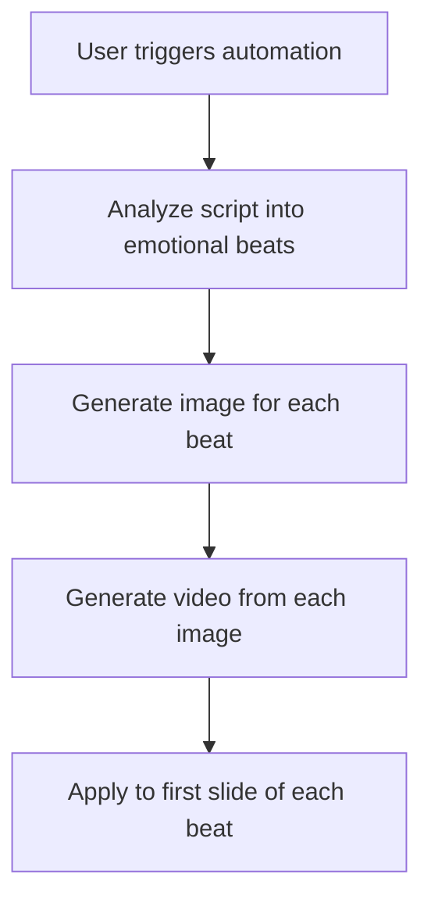
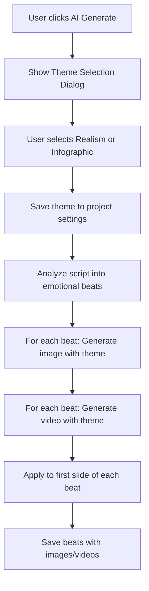

# Theme-Aware Automation Pipeline

## Overview

Enhance the automation pipeline to generate **one image and one video per emotional beat**, with theme-specific prompts for both **Realism** and **Infographic** styles.

---

## Current State Analysis

### Existing Automation Flow



### Current Issues

1. **No theme awareness**: The automation uses hardcoded "Ultra realistic, professional, cinematic" prompts
2. **Webhook dependency**: [`generate-beat-image`](src/app/api/generate-beat-image/route.ts:21) uses a webhook with hardcoded realism prompt
3. **Missing theme parameter**: [`image-to-video`](src/app/api/image-to-video/route.ts:6) accepts theme but automation doesn't pass it
4. **No theme persistence**: User's theme choice is not saved to project settings

### What Works Well

- ✅ Pipeline generates one image + video per beat
- ✅ Applies to first slide of each beat
- ✅ Theme system exists in [`image-themes.ts`](src/lib/image-themes.ts)
- ✅ Manual generation supports themes

---

## Proposed Architecture

### Enhanced Automation Flow



### Data Flow

```typescript
// User Selection
theme: 'realism' | 'infographic'

// Passed to automation pipeline
runAutoPipeline({ slides, originalScript, theme })

// Passed to each API call
/api/generate-beat-image { prompt, theme }
/api/image-to-video { imageUrl, prompt, theme }

// Stored in project
project.settings.imageTheme = theme
```

---

## Implementation Plan

### 1. Update API Routes

#### [`src/app/api/generate-beat-image/route.ts`](src/app/api/generate-beat-image/route.ts)

**Current:**

```typescript
body: JSON.stringify({
  prompt: `Ultra realistic, professional, cinematic: ${prompt.trim()}`,
});
```

**Proposed:**

```typescript
import { getThemeConfig, type ImageTheme } from "@/lib/image-themes";

export async function POST(request: NextRequest) {
  const { prompt, theme = "realism" } = await request.json();
  const themeConfig = getThemeConfig(theme as ImageTheme);

  body: JSON.stringify({
    prompt: `${themeConfig.promptPrefix} ${prompt.trim()}`,
  });
}
```

**Changes:**

- Accept `theme` parameter (default: 'realism')
- Use theme config for prompt prefix
- Maintain webhook compatibility

---

### 2. Update Frontend Automation Trigger

#### [`src/components/editor/editor-content.tsx`](src/components/editor/editor-content.tsx:249)

**Current:**

```typescript
const runAutoPipeline = useCallback(
  async ({
    slides,
    originalScript,
  }: {
    slides: Slide[];
    originalScript: string;
  }) => {
    // ... generates images and videos without theme
  },
);
```

**Proposed:**

```typescript
const runAutoPipeline = useCallback(
  async ({
    slides,
    originalScript,
    theme = "realism",
  }: {
    slides: Slide[];
    originalScript: string;
    theme?: ImageGenerationTheme;
  }) => {
    // Pass theme to image generation
    const imageResponse = await fetch("/api/generate-beat-image", {
      method: "POST",
      headers: { "Content-Type": "application/json" },
      body: JSON.stringify({
        prompt: beat.visualPrompt,
        theme, // NEW
      }),
    });

    // Pass theme to video generation
    const videoResponse = await fetch("/api/image-to-video", {
      method: "POST",
      headers: { "Content-Type": "application/json" },
      body: JSON.stringify({
        imageUrl: beat.imageUrl,
        prompt: beat.videoPrompt || "Cinematic slow camera movement",
        theme, // NEW
      }),
    });
  },
);
```

---

### 3. Update Script Input Component

#### [`src/components/editor/script-input.tsx`](src/components/editor/script-input.tsx:424)

**Current:**

```typescript
const handleThemeSelectedAndGenerate = async (theme: ImageGenerationTheme) => {
  setShowThemeDialog(false);
  setSelectedImageTheme(theme);

  // ... generates slides but doesn't pass theme to automation
};
```

**Proposed:**

```typescript
const handleThemeSelectedAndGenerate = async (theme: ImageGenerationTheme) => {
  setShowThemeDialog(false);
  setSelectedImageTheme(theme);

  // Save theme to project settings
  await updateProject.mutateAsync({
    id: projectId,
    settings: {
      ...project.settings,
      imageTheme: theme,
    },
  });

  // ... existing slide generation code ...

  // Pass theme to automation pipeline
  if (options?.autoPipeline) {
    await runAutoPipeline({
      slides,
      originalScript: project.original_script,
      theme, // NEW
    });
  }
};
```

---

### 4. Enhance Theme Configuration

#### [`src/lib/image-themes.ts`](src/lib/image-themes.ts)

**Add beat-specific prompt builders:**

```typescript
export function buildBeatImagePrompt(
  theme: ImageTheme,
  visualPrompt: string,
): string {
  const config = getThemeConfig(theme);
  return `${config.promptPrefix} ${visualPrompt}`;
}

export function buildBeatVideoPrompt(
  theme: ImageTheme,
  videoPrompt: string,
): string {
  const config = getThemeConfig(theme);
  return `${videoPrompt}. ${config.videoPromptModifier}`;
}
```

---

## Theme-Specific Prompt Examples

### Realism Theme

**Image Prompt:**

```
Ultra realistic, professional photograph, high quality, 4K resolution,
cinematic lighting, clean composition, photorealistic, natural colors,
professional photography. [Beat visual prompt]
```

**Video Prompt:**

```
[Beat video prompt]. Smooth camera movement, realistic motion, natural transitions.
```

### Infographic Theme

**Image Prompt:**

```
Modern infographic style, clean vector illustration, flat design, minimalist,
professional diagram, bold colors, simple shapes, educational visual, icon-based,
geometric, contemporary graphic design. [Beat visual prompt]
```

**Video Prompt:**

```
[Beat video prompt]. Animated infographic elements, smooth transitions, icon movements.
```

---

## Testing Strategy

### Test Cases

1. **Realism Theme Automation**
   - Select "Realism" theme
   - Verify all beat images are photorealistic
   - Verify all beat videos have smooth camera movements
   - Check theme is saved to project settings

2. **Infographic Theme Automation**
   - Select "Infographic" theme
   - Verify all beat images are flat design/vector style
   - Verify all beat videos have animated elements
   - Check theme is saved to project settings

3. **Theme Persistence**
   - Generate with Realism
   - Reload project
   - Verify theme is remembered for next generation

4. **Mixed Content**
   - Generate some beats with Realism
   - Generate other beats with Infographic
   - Verify each beat maintains its theme

---

## Migration Considerations

### Backward Compatibility

- Default theme to `'realism'` if not specified
- Existing projects without `imageTheme` setting will use realism
- Webhook endpoint remains compatible (just receives enhanced prompts)

### Database Schema

No schema changes needed. The `imageTheme` field is already defined in [`ProjectSettings`](src/types/index.ts:121):

```typescript
export interface ProjectSettings {
  theme: "light" | "dark";
  textSize: number;
  textAlignment: "center" | "left" | "right";
  projectType?: "vsl" | "infographic";
  imageTheme?: ImageGenerationTheme; // ✅ Already exists
  audio?: AudioSettings;
  selectedSlideIndex?: number;
  infographicData?: InfographicData;
}
```

---

## Files to Modify

### API Routes

- ✅ [`src/app/api/generate-beat-image/route.ts`](src/app/api/generate-beat-image/route.ts) - Add theme parameter
- ✅ [`src/app/api/image-to-video/route.ts`](src/app/api/image-to-video/route.ts) - Already supports theme

### Frontend Components

- ✅ [`src/components/editor/editor-content.tsx`](src/components/editor/editor-content.tsx) - Pass theme to automation
- ✅ [`src/components/editor/script-input.tsx`](src/components/editor/script-input.tsx) - Save theme to settings

### Utilities

- ✅ [`src/lib/image-themes.ts`](src/lib/image-themes.ts) - Add beat-specific helpers

---

## Success Criteria

- [ ] Theme selection dialog appears before automation starts
- [ ] Selected theme is saved to project settings
- [ ] Each emotional beat generates one image with theme-specific prompt
- [ ] Each emotional beat generates one video with theme-specific prompt
- [ ] Realism theme produces photorealistic outputs
- [ ] Infographic theme produces flat design/vector outputs
- [ ] Theme persists across project reloads
- [ ] Automation completes successfully for both themes

---

## Timeline

| Task                                 | Complexity | Dependencies |
| ------------------------------------ | ---------- | ------------ |
| Update `generate-beat-image` API     | Low        | None         |
| Update `editor-content` automation   | Medium     | API changes  |
| Update `script-input` theme handling | Medium     | None         |
| Add theme helpers to `image-themes`  | Low        | None         |
| Testing both themes                  | Medium     | All above    |
| Documentation                        | Low        | All above    |

---

## Questions & Clarifications

1. **Should theme be changeable per beat?**
   - Current plan: One theme for entire automation run
   - Alternative: Allow different themes per beat (more complex)

2. **Should we show theme in beat cards?**
   - Could add theme indicator to emotional beats sidebar
   - Helps users know which theme was used

3. **What about manual image generation?**
   - Already supports themes via [`ai-image-dialog.tsx`](src/components/editor/ai-image-dialog.tsx:50)
   - No changes needed

---

## Next Steps

1. Implement API route changes
2. Update frontend automation trigger
3. Add theme persistence
4. Test with both themes
5. Document user-facing changes
