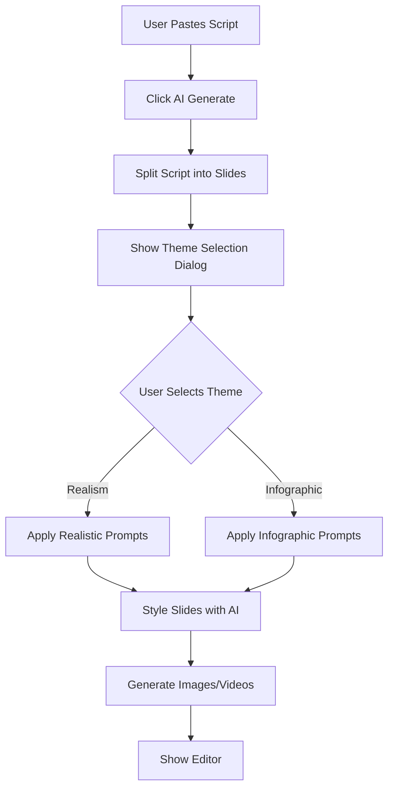

# Theme Selection Feature - Architecture Plan

## Overview

Add a theme selection feature that allows users to choose between **Realism** and **Infographic** styles for AI-generated images and videos. The theme selection will appear after slide generation and before the automation pipeline begins.

## Current Workflow Analysis

### Existing Image Generation Flow

1. **Script Input** ([`script-input.tsx`](../src/components/editor/script-input.tsx))
   - User pastes VSL script
   - Clicks "AI Generate" button
   - Script is split into slides via [`/api/split-script`](../src/app/api/split-script/route.ts)
   - Slides are styled via [`/api/style-slides`](../src/app/api/style-slides/route.ts)
   - Images are generated automatically

2. **Image Generation APIs**
   - [`/api/generate-prompt`](../src/app/api/generate-prompt/route.ts) - Creates AI prompts
   - [`/api/generate-image`](../src/app/api/generate-image/route.ts) - Generates images (OpenAI/Gemini)
   - [`/api/generate-beat-image`](../src/app/api/generate-beat-image/route.ts) - Generates beat images
   - [`/api/image-to-video`](../src/app/api/image-to-video/route.ts) - Converts images to videos

3. **Current Prompt Style**
   - Hardcoded: `"Ultra realistic, professional: ${prompt}"`
   - Applied in [`generate-image/route.ts`](../src/app/api/generate-image/route.ts) lines 41, 78
   - Applied in [`generate-prompt/route.ts`](../src/app/api/generate-prompt/route.ts) line 25

## Feature Requirements

### User Experience Flow



### Theme Definitions

#### 1. Realism Theme (Current Default)

**Purpose:** Photorealistic, professional, cinematic images

**Prompt Template:**

```
Ultra realistic, professional photograph, high quality, 4K resolution,
cinematic lighting, clean composition, photorealistic, natural colors,
professional photography. {slideText}. {imageKeyword}
```

**Image Parameters:**

- OpenAI DALL-E 3: `style: 'natural'`, `quality: 'hd'`
- Gemini Imagen 3: Standard realistic parameters
- Aspect Ratio: 16:9 (1792x1024)

**Video Parameters:**

- Smooth camera movements
- Realistic motion
- Natural transitions

#### 2. Infographic Theme (New)

**Purpose:** Clean, modern, illustrative, diagram-style visuals

**Prompt Template:**

```
Modern infographic style, clean vector illustration, flat design,
minimalist, professional diagram, bold colors, simple shapes,
educational visual, icon-based, geometric, contemporary graphic design.
{slideText}. {imageKeyword}
```

**Image Parameters:**

- OpenAI DALL-E 3: `style: 'vivid'`, `quality: 'hd'`
- Gemini Imagen 3: Enhanced color parameters
- Aspect Ratio: 16:9 (1792x1024)

**Video Parameters:**

- Animated infographic elements
- Smooth transitions
- Icon/shape movements

## Implementation Plan

### 1. Data Model Updates

#### Update [`src/types/index.ts`](../src/types/index.ts)

Add new type for image generation theme:

```typescript
export type ImageGenerationTheme = "realism" | "infographic";

export interface ProjectSettings {
  theme: "light" | "dark";
  textSize: number;
  textAlignment: "center" | "left" | "right";
  projectType?: "vsl" | "infographic";
  imageTheme?: ImageGenerationTheme; // NEW
  audio?: AudioSettings;
  selectedSlideIndex?: number;
  infographicData?: InfographicData;
}
```

### 2. Theme Configuration Module

Create [`src/lib/image-themes.ts`](../src/lib/image-themes.ts):

```typescript
export type ImageTheme = "realism" | "infographic";

export interface ThemeConfig {
  name: string;
  description: string;
  promptPrefix: string;
  promptSuffix: string;
  openAIStyle: "natural" | "vivid";
  videoPromptModifier: string;
}

export const IMAGE_THEMES: Record<ImageTheme, ThemeConfig> = {
  realism: {
    name: "Realism",
    description: "Photorealistic, professional, cinematic images",
    promptPrefix:
      "Ultra realistic, professional photograph, high quality, 4K resolution, cinematic lighting, clean composition, photorealistic, natural colors, professional photography.",
    promptSuffix: "High quality, 4K, cinematic lighting, photorealistic.",
    openAIStyle: "natural",
    videoPromptModifier:
      "Smooth camera movement, realistic motion, natural transitions.",
  },
  infographic: {
    name: "Infographic",
    description: "Clean, modern, illustrative, diagram-style visuals",
    promptPrefix:
      "Modern infographic style, clean vector illustration, flat design, minimalist, professional diagram, bold colors, simple shapes, educational visual, icon-based, geometric, contemporary graphic design.",
    promptSuffix:
      "Clean infographic style, flat design, minimalist, professional.",
    openAIStyle: "vivid",
    videoPromptModifier:
      "Animated infographic elements, smooth transitions, icon movements.",
  },
};

export function getThemeConfig(theme: ImageTheme): ThemeConfig {
  return IMAGE_THEMES[theme];
}

export function buildPromptWithTheme(
  theme: ImageTheme,
  slideText: string,
  imageKeyword?: string,
): string {
  const config = getThemeConfig(theme);
  const parts = [
    config.promptPrefix,
    slideText,
    imageKeyword ? `Subject: ${imageKeyword}.` : "",
    config.promptSuffix,
  ];
  return parts.filter(Boolean).join(" ");
}
```

### 3. UI Component - Theme Selection Dialog

Create [`src/components/editor/theme-selection-dialog.tsx`](../src/components/editor/theme-selection-dialog.tsx):

```typescript
'use client';

import { useState } from 'react';
import { Palette, Camera, BarChart3 } from 'lucide-react';
import { Button } from '@/components/ui/button';
import {
  Dialog,
  DialogContent,
  DialogHeader,
  DialogTitle,
  DialogDescription,
} from '@/components/ui/dialog';
import type { ImageGenerationTheme } from '@/types';

interface ThemeSelectionDialogProps {
  open: boolean;
  onClose: () => void;
  onThemeSelected: (theme: ImageGenerationTheme) => void;
}

export function ThemeSelectionDialog({
  open,
  onClose,
  onThemeSelected,
}: ThemeSelectionDialogProps) {
  const [selectedTheme, setSelectedTheme] = useState<ImageGenerationTheme>('realism');

  const handleContinue = () => {
    onThemeSelected(selectedTheme);
    onClose();
  };

  return (
    <Dialog open={open} onOpenChange={(isOpen) => !isOpen && onClose()}>
      <DialogContent className="sm:max-w-2xl">
        <DialogHeader>
          <DialogTitle className="flex items-center gap-2">
            <Palette className="w-5 h-5" />
            Choose Your Image Style
          </DialogTitle>
          <DialogDescription>
            Select the visual style for AI-generated images and videos in your VSL
          </DialogDescription>
        </DialogHeader>

        <div className="space-y-4 mt-4">
          <div className="grid grid-cols-2 gap-4">
            {/* Realism Theme */}
            <button
              onClick={() => setSelectedTheme('realism')}
              className={`p-6 rounded-xl border-2 text-left transition-all ${
                selectedTheme === 'realism'
                  ? 'border-black bg-gray-50 shadow-md'
                  : 'border-gray-200 hover:border-gray-300'
              }`}
            >
              <div className="flex items-center gap-3 mb-3">
                <div className="p-2 bg-blue-100 rounded-lg">
                  <Camera className="w-6 h-6 text-blue-600" />
                </div>
                <div>
                  <div className="font-bold text-lg">Realism</div>
                  <div className="text-xs text-gray-500">Photorealistic</div>
                </div>
              </div>
              <p className="text-sm text-gray-600 leading-relaxed">
                Professional photographs with cinematic lighting. Perfect for
                authentic, trustworthy, and high-end presentations.
              </p>
              <div className="mt-4 flex flex-wrap gap-2">
                <span className="text-xs px-2 py-1 bg-blue-50 text-blue-700 rounded">
                  4K Quality
                </span>
                <span className="text-xs px-2 py-1 bg-blue-50 text-blue-700 rounded">
                  Natural
                </span>
                <span className="text-xs px-2 py-1 bg-blue-50 text-blue-700 rounded">
                  Professional
                </span>
              </div>
            </button>

            {/* Infographic Theme */}
            <button
              onClick={() => setSelectedTheme('infographic')}
              className={`p-6 rounded-xl border-2 text-left transition-all ${
                selectedTheme === 'infographic'
                  ? 'border-black bg-gray-50 shadow-md'
                  : 'border-gray-200 hover:border-gray-300'
              }`}
            >
              <div className="flex items-center gap-3 mb-3">
                <div className="p-2 bg-purple-100 rounded-lg">
                  <BarChart3 className="w-6 h-6 text-purple-600" />
                </div>
                <div>
                  <div className="font-bold text-lg">Infographic</div>
                  <div className="text-xs text-gray-500">Illustrative</div>
                </div>
              </div>
              <p className="text-sm text-gray-600 leading-relaxed">
                Clean vector illustrations and diagrams. Ideal for educational
                content, data visualization, and modern tech presentations.
              </p>
              <div className="mt-4 flex flex-wrap gap-2">
                <span className="text-xs px-2 py-1 bg-purple-50 text-purple-700 rounded">
                  Flat Design
                </span>
                <span className="text-xs px-2 py-1 bg-purple-50 text-purple-700 rounded">
                  Bold Colors
                </span>
                <span className="text-xs px-2 py-1 bg-purple-50 text-purple-700 rounded">
                  Modern
                </span>
              </div>
            </button>
          </div>

          {/* Preview Examples */}
          <div className="p-4 bg-gray-50 rounded-lg border">
            <div className="text-sm font-medium mb-2">
              {selectedTheme === 'realism' ? '📸 Realism' : '📊 Infographic'} Style Preview
            </div>
            <p className="text-xs text-gray-600">
              {selectedTheme === 'realism'
                ? 'Your images will look like professional photographs with natural lighting, realistic textures, and cinematic composition.'
                : 'Your images will feature clean vector graphics, flat design elements, bold colors, and modern minimalist aesthetics.'}
            </p>
          </div>

          <div className="flex justify-end gap-2 pt-2">
            <Button variant="ghost" onClick={onClose}>
              Cancel
            </Button>
            <Button
              onClick={handleContinue}
              className="bg-black text-white hover:bg-gray-800 gap-2"
            >
              Continue with {selectedTheme === 'realism' ? 'Realism' : 'Infographic'}
            </Button>
          </div>
        </div>
      </DialogContent>
    </Dialog>
  );
}
```

### 4. API Updates

#### Update [`src/app/api/generate-prompt/route.ts`](../src/app/api/generate-prompt/route.ts)

```typescript
import { NextRequest, NextResponse } from "next/server";
import { buildPromptWithTheme, type ImageTheme } from "@/lib/image-themes";

export async function POST(request: NextRequest) {
  try {
    const {
      slideText,
      imageKeyword,
      sceneTitle,
      emotion,
      theme = "realism", // NEW: default to realism
    } = await request.json();

    if (!slideText) {
      return NextResponse.json(
        { error: "Slide text is required" },
        { status: 400 },
      );
    }

    // Call the n8n webhook to generate an image prompt
    const response = await fetch(
      "https://themacularprogram.app.n8n.cloud/webhook/generate-prompt",
      {
        method: "POST",
        headers: { "Content-Type": "application/json" },
        body: JSON.stringify({
          slideText,
          imageKeyword: imageKeyword || "",
          sceneTitle: sceneTitle || "",
          emotion: emotion || "",
          theme, // NEW: pass theme to webhook
        }),
      },
    );

    if (!response.ok) {
      const errText = await response.text();
      console.error("Webhook error:", errText);
      // Fallback: generate a basic prompt locally with theme
      const fallbackPrompt = buildPromptWithTheme(
        theme as ImageTheme,
        slideText,
        imageKeyword,
      );
      return NextResponse.json({ prompt: fallbackPrompt, source: "fallback" });
    }

    const data = await response.json();
    const prompt =
      typeof data === "string"
        ? data
        : data.prompt ||
          data.output ||
          data.text ||
          data.message ||
          JSON.stringify(data);

    return NextResponse.json({ prompt, source: "webhook" });
  } catch (error: unknown) {
    console.error("Generate prompt error:", error);
    const errorMessage =
      error instanceof Error ? error.message : "Failed to generate prompt";
    return NextResponse.json({ error: errorMessage }, { status: 500 });
  }
}
```

#### Update [`src/app/api/generate-image/route.ts`](../src/app/api/generate-image/route.ts)

```typescript
import { NextRequest, NextResponse } from "next/server";
import { getThemeConfig, type ImageTheme } from "@/lib/image-themes";

export async function POST(request: NextRequest) {
  try {
    const {
      prompt,
      provider,
      apiKey,
      theme = "realism", // NEW: default to realism
    } = await request.json();

    if (!prompt || !provider || !apiKey) {
      return NextResponse.json(
        { error: "Prompt, provider, and API key are required" },
        { status: 400 },
      );
    }

    if (provider === "openai") {
      return await generateWithOpenAI(prompt, apiKey, theme as ImageTheme);
    } else if (provider === "gemini") {
      return await generateWithGemini(prompt, apiKey, theme as ImageTheme);
    } else {
      return NextResponse.json(
        { error: 'Invalid provider. Use "openai" or "gemini".' },
        { status: 400 },
      );
    }
  } catch (error: unknown) {
    console.error("Generate image error:", error);
    const errorMessage =
      error instanceof Error ? error.message : "Failed to generate image";
    return NextResponse.json({ error: errorMessage }, { status: 500 });
  }
}

async function generateWithOpenAI(
  prompt: string,
  apiKey: string,
  theme: ImageTheme = "realism",
) {
  const themeConfig = getThemeConfig(theme);

  const response = await fetch("https://api.openai.com/v1/images/generations", {
    method: "POST",
    headers: {
      "Content-Type": "application/json",
      Authorization: `Bearer ${apiKey}`,
    },
    body: JSON.stringify({
      model: "dall-e-3",
      prompt: `${themeConfig.promptPrefix} ${prompt}`,
      n: 1,
      size: "1792x1024",
      quality: "hd",
      style: themeConfig.openAIStyle, // NEW: theme-based style
    }),
  });

  if (!response.ok) {
    const err = await response.json().catch(() => ({}));
    const msg = err?.error?.message || `OpenAI API error (${response.status})`;
    return NextResponse.json({ error: msg }, { status: response.status });
  }

  const data = await response.json();
  const imageUrl = data.data?.[0]?.url;
  const revisedPrompt = data.data?.[0]?.revised_prompt;

  if (!imageUrl) {
    return NextResponse.json(
      { error: "No image returned from OpenAI" },
      { status: 500 },
    );
  }

  return NextResponse.json({ imageUrl, revisedPrompt, provider: "openai" });
}

async function generateWithGemini(
  prompt: string,
  apiKey: string,
  theme: ImageTheme = "realism",
) {
  const themeConfig = getThemeConfig(theme);

  const response = await fetch(
    `https://generativelanguage.googleapis.com/v1beta/models/imagen-3.0-generate-002:predict?key=${apiKey}`,
    {
      method: "POST",
      headers: { "Content-Type": "application/json" },
      body: JSON.stringify({
        instances: [
          {
            prompt: `${themeConfig.promptPrefix} ${prompt}`,
          },
        ],
        parameters: {
          sampleCount: 1,
          aspectRatio: "16:9",
        },
      }),
    },
  );

  if (!response.ok) {
    const err = await response.json().catch(() => ({}));
    const msg = err?.error?.message || `Gemini API error (${response.status})`;
    return NextResponse.json({ error: msg }, { status: response.status });
  }

  const data = await response.json();
  const imageBytes = data.predictions?.[0]?.bytesBase64Encoded;

  if (!imageBytes) {
    return NextResponse.json(
      { error: "No image returned from Gemini" },
      { status: 500 },
    );
  }

  const imageUrl = `data:image/png;base64,${imageBytes}`;
  return NextResponse.json({ imageUrl, provider: "gemini" });
}
```

#### Update [`src/app/api/image-to-video/route.ts`](../src/app/api/image-to-video/route.ts)

```typescript
import { GoogleGenAI } from "@google/genai";
import { getThemeConfig, type ImageTheme } from "@/lib/image-themes";

export async function POST(req: Request) {
  try {
    const {
      imageUrl,
      prompt,
      theme = "realism", // NEW: default to realism
    } = await req.json();

    if (!imageUrl || !prompt) {
      return Response.json(
        { error: "Missing imageUrl or prompt" },
        { status: 400 },
      );
    }

    const apiKey = process.env.GOOGLE_API_KEY;
    if (!apiKey) {
      return Response.json(
        { error: "Google API key not configured" },
        { status: 500 },
      );
    }

    const ai = new GoogleGenAI({ apiKey });
    const themeConfig = getThemeConfig(theme as ImageTheme);

    // Fetch the image from URL
    console.log("Fetching image from:", imageUrl);
    const imageResponse = await fetch(imageUrl);
    if (!imageResponse.ok) {
      return Response.json(
        { error: `Failed to fetch image: ${imageResponse.statusText}` },
        { status: 400 },
      );
    }
    const mimeType = imageResponse.headers.get("content-type") || "image/png";
    const imageBuffer = await imageResponse.arrayBuffer();
    const imageBytes = Buffer.from(imageBuffer).toString("base64");

    console.log("Starting Veo video generation...");

    // Generate video with theme-modified prompt
    const enhancedPrompt = `${prompt}. ${themeConfig.videoPromptModifier}`;

    let operation = await ai.models.generateVideos({
      model: "veo-3.1-generate-preview",
      prompt: enhancedPrompt,
      image: {
        imageBytes: imageBytes,
        mimeType: mimeType,
      },
    });

    console.log("Operation started, polling for completion...");

    // Poll the operation status
    let attempts = 0;
    const maxAttempts = 30;

    while (!operation.done && attempts < maxAttempts) {
      console.log(`Polling attempt ${attempts + 1}/${maxAttempts}...`);
      await new Promise((resolve) => setTimeout(resolve, 10000));

      operation = await ai.operations.getVideosOperation({
        operation: operation,
      });
      attempts++;
    }

    if (!operation.done) {
      throw new Error("Video generation timeout after 5 minutes");
    }

    // Check for errors
    if ((operation as any).error) {
      const err = (operation as any).error;
      throw new Error(
        `Video generation failed: ${err.message || JSON.stringify(err)}`,
      );
    }

    // Check for content safety filtering
    const raiReasons = operation.response?.raiMediaFilteredReasons;
    if (raiReasons && raiReasons.length > 0) {
      throw new Error(raiReasons[0]);
    }

    if (!operation.response?.generatedVideos?.[0]?.video?.uri) {
      throw new Error("No video generated — the API returned an empty result.");
    }

    const videoUri = operation.response.generatedVideos[0].video.uri;
    console.log("Video generated successfully:", videoUri);

    // Download the video file
    const videoResponse = await fetch(videoUri, {
      headers: {
        "X-Goog-Api-Key": apiKey,
      },
    });

    if (!videoResponse.ok) {
      console.error("Failed to download video file:", videoResponse.statusText);
      return Response.json({
        videoUri: videoUri,
        success: true,
        note: "Video generated but download may require authentication",
      });
    }

    const videoBuffer = await videoResponse.arrayBuffer();
    const videoBase64 = Buffer.from(videoBuffer).toString("base64");

    return Response.json({
      videoUri: videoUri,
      videoData: videoBase64,
      success: true,
      message: "Video generated and downloaded successfully",
    });
  } catch (error) {
    console.error("Image to video error:", error);
    const errorMsg =
      error instanceof Error ? error.message : "Failed to generate video";
    return Response.json({ error: errorMsg }, { status: 500 });
  }
}
```

### 5. Integration into Script Input Workflow

Update [`src/components/editor/script-input.tsx`](../src/components/editor/script-input.tsx):

```typescript
// Add new state
const [showThemeDialog, setShowThemeDialog] = useState(false);
const [selectedTheme, setSelectedTheme] = useState<ImageGenerationTheme>('realism');
const [pendingSlides, setPendingSlides] = useState<Slide[]>([]);

// Modify handleAIGenerate to show theme dialog after split
const handleAIGenerate = async () => {
  // ... existing code for split-script ...

  // After slides are created (line ~510)
  setProgress(35);
  console.log(`%c🧠 STEP 1 COMPLETE: ${slides.length} slides created`, ...);

  // NEW: Show theme selection dialog
  setPendingSlides(slides);
  setShowThemeDialog(true);
  setGenerating(false); // Pause generation
};

// NEW: Handle theme selection
const handleThemeSelected = async (theme: ImageGenerationTheme) => {
  setSelectedTheme(theme);
  setShowThemeDialog(false);
  setGenerating(true);

  // Save theme to project
  await updateProject.mutateAsync({
    projectId,
    updates: {
      settings: {
        ...currentSettings,
        imageTheme: theme
      }
    },
  });

  // Continue with styling and image generation
  await continueGeneration(pendingSlides, theme);
};

// NEW: Continue generation with selected theme
const continueGeneration = async (slides: Slide[], theme: ImageGenerationTheme) => {
  // ... existing style-slides code ...
  // Pass theme to all image generation calls
};

// Add theme dialog to JSX
return (
  <>
    {/* Existing dialog */}
    <Dialog open={showOptions} onOpenChange={setShowOptions}>
      {/* ... */}
    </Dialog>

    {/* NEW: Theme selection dialog */}
    <ThemeSelectionDialog
      open={showThemeDialog}
      onClose={() => {
        setShowThemeDialog(false);
        setGenerating(false);
        setPendingSlides([]);
      }}
      onThemeSelected={handleThemeSelected}
    />
  </>
);
```

### 6. Update AI Image Dialog

Update [`src/components/editor/ai-image-dialog.tsx`](../src/components/editor/ai-image-dialog.tsx):

```typescript
// Add theme prop
interface AiImageDialogProps {
  open: boolean;
  onClose: () => void;
  slideText: string;
  imageKeyword?: string;
  sceneTitle?: string;
  emotion?: string;
  theme?: ImageGenerationTheme; // NEW
  onImageGenerated: (imageUrl: string) => void;
}

// Pass theme to generate-image API
const handleGenerateImage = async () => {
  // ...
  const response = await fetch("/api/generate-image", {
    method: "POST",
    headers: { "Content-Type": "application/json" },
    body: JSON.stringify({
      prompt,
      provider: selectedProvider,
      apiKey: key,
      theme: theme || "realism", // NEW
    }),
  });
  // ...
};
```

## Testing Strategy

### Unit Tests

1. Test theme configuration module
2. Test prompt building with different themes
3. Test API parameter changes based on theme

### Integration Tests

1. Test theme selection dialog flow
2. Test theme persistence in project settings
3. Test image generation with both themes
4. Test video generation with both themes

### User Acceptance Tests

1. Generate VSL with realism theme
2. Generate VSL with infographic theme
3. Switch themes mid-project
4. Verify theme applies to all image/video generation

## Migration Strategy

### Backward Compatibility

- Default theme: `'realism'` (maintains current behavior)
- Existing projects without theme setting will use realism
- No breaking changes to existing APIs

### Rollout Plan

1. Deploy theme configuration module
2. Update APIs with backward-compatible theme parameter
3. Deploy theme selection UI
4. Update documentation
5. Announce feature to users

## Future Enhancements

### Phase 2 Features

1. **Custom Themes** - Allow users to create custom prompt templates
2. **Theme Presets** - Add more themes (e.g., "Cartoon", "3D Render", "Sketch")
3. **Per-Slide Theme Override** - Allow different themes for different slides
4. **Theme Gallery** - Show example images for each theme
5. **AI Theme Recommendation** - Suggest theme based on script content

### Phase 3 Features

1. **Theme Marketplace** - Community-created themes
2. **Advanced Theme Settings** - Fine-tune prompt parameters
3. **A/B Testing** - Generate same slide with multiple themes
4. **Theme Analytics** - Track which themes perform best

## Success Metrics

### Key Performance Indicators

1. **Adoption Rate** - % of users who select non-default theme
2. **User Satisfaction** - Feedback on theme quality
3. **Generation Success Rate** - % of successful image/video generations
4. **Theme Distribution** - Usage split between realism and infographic

### Technical Metrics

1. **API Response Time** - No degradation with theme parameter
2. **Error Rate** - Maintain current error rates
3. **Theme Persistence** - 100% accuracy in saving/loading theme

## Documentation Requirements

### User Documentation

1. Theme selection guide
2. When to use each theme
3. Example outputs for each theme
4. FAQ about themes

### Developer Documentation

1. Theme configuration API
2. Adding new themes
3. Theme integration guide
4. Testing theme features

## Conclusion

This theme selection feature provides users with creative control over their VSL visual style while maintaining the automated workflow. The implementation is backward-compatible, extensible, and follows the existing architecture patterns.

The feature will be implemented in phases, starting with the core realism vs infographic selection, with future enhancements planned based on user feedback and usage patterns.
